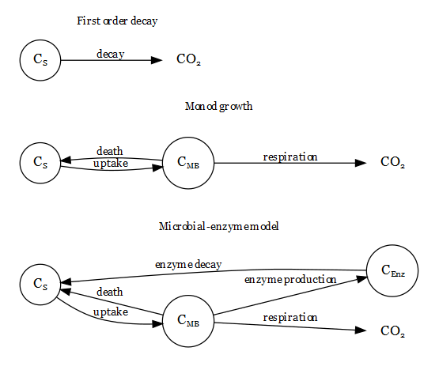

```{r setup, include=FALSE}
knitr::opts_chunk$set(echo = TRUE, tidy.opts=list(width.cutoff=40),tidy=TRUE)

library(knitr)
library(ggplot2)
library(grid)
library(DiagrammeR)
library(DiagrammeRsvg)
library(rsvg)
library(kableExtra)
library(magick)


theme_min<-theme(axis.text.x=element_text(vjust=0.2, size=14, colour="black"),
                 axis.text.y=element_text(hjust=0.2, size=14, colour="black"),
                 axis.title=element_text(size=14, colour="black"),
                 axis.line=element_line(size=0.5, colour="black"),
                 strip.text=element_text(size=16, face="bold"),
                 axis.ticks=element_line(size=1, colour="black"),
                 axis.ticks.length=unit(-0.05, "cm"),
                 panel.background=element_rect(colour="black", fill="white"),
                 panel.grid=element_line(linetype=0),
                 legend.text=element_text(size=14, colour="black"),
                 legend.title=element_text(size=14, colour="black"),
                 legend.position=c("right"),
                 legend.key.size=unit(1, "cm"),
                 strip.background=element_rect(fill="grey98", colour="black"),
                 legend.key=element_rect(fill="white", size=1.2),
                 legend.spacing=unit(0.5, "cm"),
                 plot.title=element_text(size=28, face="bold", hjust=-0.05))


```

_^1^Pacific Northwest National Laboratory, Environmental Molecular Sciences Laboratory, Richland, WA USA_

## Abstract

## Introduction

## Material and Methods
###Experimental design
Microbial culture obtained from the soil (see later) was incubated in liquid batch culture microcosms at 24&deg;C in the dark for five days under nine different experimental treatments. These treatments include three different organic substrates as a sole source of carbon for microbial culture and three different levels of microcosm structural complexity in fully factorial design. The three organic substrates were glucose, cellobiose and mixture of glucose, cellobiose and cellulose. The three levels of structural complexity were represented by **_??34 ml??_** incubation vials with liquid medium only (denoted as **"BROTH"** further in the text), with liquid medium and mixture of 2.7, 0.1 and 0.1 mm glass beads (5 g of 2.7 mm Biospec glass beads, 2 g of 1.0 mm Biospec glass beads and 1 g of 0.1 mm Next-Advanced glass beads; denoted as **"GLASS"** further in the text) and with liquid medium and glass wool (0.2 g of Pyrex fiber glass wool cutted to ~0.25 cm pieces; denoted as **"WOOL"** further in the text). All experimental treatments were replicated four times **_but this is probably not true since the sampling was destructive_**.

###Microbial culture
Microbial culture used in the experiment was obtained by imbibement of the **_??prosser soil?? (is it correct)_**, _short characteristic of soil_ ... with the growth medium. One gram of air dried soil was supplemented by the 10 ml of sterile Cellulose Degrader M9 Media (see later) with 6.25 ml of lysogeny broth. The final organic carbon concentration of added medium was ~40 mmol l^-1^ (0.4 mmol g(DW)^-1^). The soil with medium was incubated seven days at 24&deg;C in dark. At the end of incubation, soil-medium suspension was shaken with ~ten 2.7 mm glass beats for ten minutes. The suspension was transferred to sterile flask and soil particles were allowed to settle down. The liquid phase was further transferred to new sterile flask and used to inoculate a microcosms.   

###Microcosm
**_??34 ml??_** incubation vials with glass beads, glass wool or empty were filled with 3 ml of sterile medium and 1 ml of microbial culture. The medium was composed of Cellulose Degrader M9 Media and organic substrate (the final concentration 1 g of organic substrate per one liter of medium). Cellulose Degrader M9 Media was prepared by mixing 300 ml of M9 Minimal Media 10X stock solution (59.623 g anhydrous $NaH_{2}PO_{4}$, 29.938 g $KH_{2}PO_{4}$, 4.967 g NaCl, 10.003 g $NH_{4}Cl$, 1.204 g anhydrous $MgSO_{4}$ and 0.140 g $CaCl_{2}\cdot2H_{2}0$ in 1 l of ultra pure water), 10 ml of Hutner's Trace Element Solution (10 g $C_{6}H_{9}NO_{6}$, 7.3 g KOH, 14.45 g $MgSO_{4}$, 3.335 g $CaCl_{2}\cdot2H_{2}0$, 0.00925 g $(NH_{4})_{6}Mo_{7}O_{24}\cdot4H_{2}0$, 0.099 g $FeSO_{4}\cdot7H_{2}0$ and 50 mL of Hutner's Stock Salt Solution in 1 l of ultra pure water), 1 ml of Biotin (1 g $l^{-1}$), 1 ml of Thiamin (1 g $l^{-1}$) and ultra pure water to 1 l. Accounting for the dilution by the inoculum with assumed organic carbon concentration nearly zero, initial organic carbon concentration of the microcosms was 25 mmol $l^{-1}$. Initial microbial biomass concentration of the microocosm was measured (see later) to be 7 mmol of microbial carbon per liter. Incubation vials were kept covered by Breathe-Easy sealing membrane secured with the aluminium cap at all times the respiration rate was not measured. **_(short decription of the incubator)_**.

###Respiration rate
Microbial respiration rate was measured at the beginning of the experiment and each following day (six times in total). Approximately two hours before the headspace $CO_{2}$ concentration measurement, Breathe-Easy sealing membranes were removed from the incubation vials and replaced by the ruber septa secured with the alluminium cap. Vials headspace was exhcanged for the $CO_{2}$-free air and incubated. Headspace was sampled using 5 ml gas tight syringe. 1.5 ml of well mixed headspace air was sampled and directly injected to Li-Cor Li 7000 (LI-COR, Inc., Lincoln, Nebraska, USA). $CO_{2}$ concentration was calculated against the calibartion standard gas of the $CO_{2}$ concentration 2000 ppm. $CO_{2}$ concentration was corrected for the $CO_{2}$ dissolution in liquid media according to Sparling and West [-@Sparling1990]. Respiration rate was further calculated as corrected $CO_{2}$ concentration divided by the time since the vials were closed. 

###DNA isolation and quantification
To quantify microbial biomass in the microcosms, DNA was isolated from samples before the start of the experiment, first, second and last day of incubation. The sampling was destructive. The whole volume of microcosm containing microbial cells was quantitatively transfered to 15 ml falcon tubes. Cell scraper was used to detach microbial cells from surface of microcosm or from glass beads/wool. Two ml of phosphate buffer was added and the final solution thoroughly mixed. The final solution was centrifuged at 4,700 g for ten minutes at 4&deg;C and pelet was separated from supernatant. Supernatant was anaylzed for protein concentration (see later). Pellet was resuspended in 0.5 ml and kept deep frozen (-80&deg;C) until the assay was conducted. 
Cell pelet was bead beated in ethanol solution for 5 minutes to lyse the cells. To isolate DNA from the cell lysate, DNeasy PowerSoil Kit (QIAGEN, Venlo, Netherland) was used. DNA concentration was measured by a Nanodrop meter **_(specification)_**. DNA concentration was conversed to microbial biomass carbon using several conversion factors published in literature (see Fig. 1)  

###Cellular protein quantification
As a complementary method for microbial biomass quantification, protein concentration was assesed in cell lysate by bicinchoninic acid assay. **_(specification of spectrophotometer)_** was used to measure protein concentration. Alike DNA, protein concentration was conversed to microbial biomass carbon using several conversion factors published in literature (see Fig. 1)  

###Extracellular protein concentration
Protein concentration was further assesed in the supernatant (see above). Before the analysis, supernatant was filtered through 10 kDa Supor membrane. Protein concentration was measured in >10 kDa fraction. This fraction is assumed to be dominated be extracellular enzymes produced by microbial cells. Extracellular enzymes are assumed to contain 46% of carbon [@Vrede2004].

###Mathematical description
Five models of different complexity were used to predict patterns of respiration rate, microbial biomass carbon ($C_{MB}$) or extracellular enzyme concentration ($C_{Enz}$) during the experiment. The emphasis is given to respiration rate prediction.  

####First order decay (Fig. 1a)
In this simplest model, organic carbon ($C_{S}$) decays into $CO_{2}$ at the constant rate (k):

[1] $~~~~~~~~~~\frac{dC_{S}}{dt}~=~k~\times~C_{S}$,


organic substrate (glucose, cellobiose or their mixture) and the microbial biomass are considered as $C_{S}$ in this model. $C_{MB}$ and $C_{Enz}$ cannot be predicted by the model since they are not explicitely assumed to affect the respiration rate.  


####Monod growth (Fig. 1b)
In this model, $C_{S}$ is consumed by microbial biomass and transformed to $CO_{2}$ or $C_{MB}$. Microbial biomass is dying at constant rate returning used organic carbon to $C_{S}$ pool:

[2] $~~~~~~~~~~\frac{dC_{MB}}{dt}~=~uptake~\times~CUE~-~k_{MB}~\times~C_{MB}$,

[3] $~~~~~~~~~~\frac{dC_{S}}{dt}~=~-uptake~+~k_{MB}~\times~C_{MB}$.


In eqs. 2 and 3, CUE is carbon use efficiency and $k_{MB}$ is death rate constant of microbial biomass decay process. Microbial carbon uptake is defined as hyperbolic function of $C_{S}$ and $C_{MB}$:

[4] $~~~~~~~~~~uptake~=\frac{V_{MAX}~\times~C_{S}~\times~C_{MB}}{K_{M}~+~C_{S}}$,

in which $V_{MAX}$ is maximum velocity constant and $K_{M}$ is affinity constant. Respiration rate is then given by $uptake~\times~(1~-~CUE)$. Monod growth model assumes that the production of extracellular enzymes is negligible.

####Microbial enzyme models (Fig. 1c)
In microbial enzyme models, microbial biomass produce extracellular enzymes. The way the carbon is partitioned between $C_{MB}$, $CO_{2}$ and $C_{Enz}$ can follow different rules.

* Classical microbial enzyme model (MEM)

Microbial enzyme model presented by Allison et al. [-@Allison2010] assumes that extracellular enzymes are produced constitutively by the rate ($r_{Enz}$), which is proportional to biomass:

[5] $~~~~~~~~~~enzyme~production~=~r_{Enz}~\times~C_{MB}$.

When extracellular enzymes are produced, microbial biomass is loosing carbon. Therefore, the mass balance equation for microbial biomass is:

[6] $~~~~~~~~~~\frac{dC_{MB}}{dt}~=~uptake~\times~CUE~-~death~-~enzyme~production$.


## Results

## Discussion

##Tables
```{r Tab. 1, echo=FALSE, fig.width=130, message=FALSE, warning=FALSE, results='asis'}
#tab1<-rbind(decay_all_results$likelihood, monod_all_results$ll_r, mem_all_results$ll_r,
            #mend_all_results$ll_r, mmem_all_results$ll_r)
#colnames(tab1)<-c("_Log Likelihood_", "_N_", "_R^{2}_", "_AIC_")
#rownames(tab1)<-c("First order decay", "Monod growth", "MEM", "MEND", "MMEM")
#write.csv(tab1, "./tab1.csv")

tab1<-read.csv("tab1.csv")

kable(tab1, align='c', digits=c(0, 1, 0, 2, 1), "latex", booktabs=T, escape=F, col.names = c(" ", "Log Likelihood", "N", "R^2^", "AIC"), caption = "**Tab. 1:** Correspondence between measured resiration rate and respiration rate modeled by five different models (First order decay, Monod growth, two different Microbial Enzyme Models (MEM and MEND) and Metabolic Microbial Enzyme Model (MMEM)). Log Likelihood, coefficient of determination ($R^{2}$), Akaike Information Criterion (AIC) and the number of estimated parameters are reported. All models are calibrated against measured respiration rate only.") %>%
  kable_as_image()

```

```{r Tab. 2, echo=FALSE, fig.width=130, message=FALSE, warning=FALSE, results='asis'}
# tab2a<-rbind(monod_all_results2$ll_r, mem_all_results2$ll_r,
#             mend_all_results2$ll_r, mmem_all_results2$ll_r,
#             monod_all_results4$ll_r, mem_all_results4$ll_r,
#             mend_all_results4$ll_r, mmem_all_results4$ll_r,
#             monod_all_results5$ll_r, mem_all_results5$ll_r,
#             mend_all_results5$ll_r, mmem_all_results5$ll_r,
#           monod_all_results6$ll_r, mem_all_results6$ll_r,
#             mend_all_results6$ll_r, mmem_all_results6$ll_r)
# tab2a[tab2a[,3]<0,"rsq"]<-c(0)
# 
# tab2b<-rbind(monod_all_results2$ll_Cmic, mem_all_results2$ll_Cmic,
#             mend_all_results2$ll_Cmic, mmem_all_results2$ll_Cmic,
#             monod_all_results4$ll_Cmic, mem_all_results4$ll_Cmic,
#             mend_all_results4$ll_Cmic, mmem_all_results4$ll_Cmic,
#             monod_all_results5$ll_Cmic, mem_all_results5$ll_Cmic,
#             mend_all_results5$ll_Cmic, mmem_all_results5$ll_Cmic,
#             monod_all_results6$ll_Cmic, mem_all_results6$ll_Cmic,
#             mend_all_results6$ll_Cmic, mmem_all_results6$ll_Cmic)
# tab2b[tab2b[,3]<0,"rsq"]<-c(0)
#   
# tab2<-as.data.frame(cbind(tab2a, tab2b))
# tab2$Model<-c("Monod growth", "MEM", "MEND", "MMEM","Monod growth", "MEM", "MEND", "MMEM","Monod growth", "MEM", "MEND", "MMEM","Monod growth", "MEM", "MEND", "MMEM")
# tab2<-tab2[,c(9, 1:8)]   
# 
# write.csv(tab2, "./tab2.csv")

tab2<-read.csv("tab2.csv")[,-1]


#colnames(tab1)<-c("_Log Likelihood_", "_N_", "_R^{2}_", "_AIC_")
#write.csv(tab1, "./tab1.csv")

kable(tab2, align='c', digits=c(0, 1, 0, 2, 1, 1, 0, 2, 1), "latex", escape=F, booktabs=T, col.names = c(" ", "Log Likelihood", "N", "R^2^", "AIC","Log Likelihood", "N", "R^2^", "AIC"), caption = "**Tab. 2:** Correspondence between measured and modelled resiration rate and microbial biomass carbon ($C_{MB}$). Four different models (Monod growth, two different Microbial Enzyme Models (MEM and MEND) and Metabolic Microbial Enzyme Model (MMEM)) were tested. Log Likelihood, coefficient of determination ($R^{2}$), Akaike Information Criterion (AIC) and the number of estimated parameters are reported. All models are calibrated against measured respiration rate and $C_{MB}$, which was calculated from measured DNA or cellular protein content using four different conversion factors reported in literature.") %>%
  add_header_above(c(" " = 1 ,"Respiration rate" = 4, "Microbial biomass" = 4))  %>%
  group_rows("Beck et al., 2018 (DNA ~ 0.9% Cmb)", 1 , 4) %>%
  group_rows("Median of DNA abundance across studies (DNA ~ 2.39% Cmb)", 5 , 8) %>%
  group_rows("Beck et al., 2018 (Protein ~ 60% Cmb)", 9 , 12) %>%
  group_rows("Hanegraaf and Muller, 2001 (Protein ~ 182% Cmb)", 13 , 16) %>%
  kable_styling(bootstrap_options = "striped", full_width = F, font_size = 7) %>%
  kable_as_image()

```


```{r Tab. 3, echo=FALSE, fig.width=130, message=FALSE, warning=FALSE, results='asis'}
# tab3a<-rbind(t(rbind(mem_all_results7$ll_r, mend_all_results7$ll_r, mmem_all_results7$ll_r)),
#              t(rbind(mem_all_results8$ll_r, mend_all_results8$ll_r, mmem_all_results8$ll_r)),
#              t(rbind(mem_all_results9$ll_r,mend_all_results9$ll_r, mmem_all_results9$ll_r)),
#              t(rbind(mem_all_results10$ll_r, mend_all_results10$ll_r, mmem_all_results10$ll_r)))
# colnames(tab3a)<-c("MEM", "MEND", "MMEM")
#  
# tab3b<-rbind(t(rbind(mem_all_results7$ll_Cmic, mend_all_results7$ll_Cmic, mmem_all_results7$ll_Cmic)),
#              t(rbind(mem_all_results8$ll_Cmic, mend_all_results8$ll_Cmic, mmem_all_results8$ll_Cmic)),
#              t(rbind(mem_all_results9$ll_Cmic,mend_all_results9$ll_Cmic, mmem_all_results9$ll_Cmic)),
#              t(rbind(mem_all_results10$ll_Cmic, mend_all_results10$ll_Cmic, mmem_all_results10$ll_Cmic)))
# colnames(tab3b)<-c("MEM", "MEND", "MMEM")
# tab3b[c(7,11,15),]<-c(0)
# 
# 
# tab3c<-rbind(t(rbind(mem_all_results7$ll_E, mend_all_results7$ll_E, mmem_all_results7$ll_E)),
#              t(rbind(mem_all_results8$ll_E, mend_all_results8$ll_E, mmem_all_results8$ll_E)),
#              t(rbind(mem_all_results9$ll_E,mend_all_results9$ll_E, mmem_all_results9$ll_E)),
#              t(rbind(mem_all_results10$ll_E, mend_all_results10$ll_E, mmem_all_results10$ll_E)))
# colnames(tab3c)<-c("MEM", "MEND", "MMEM")
# tab3c[c(3, 7,11,15),]<-c(0)
# 
# tab3<-as.data.frame(cbind(tab3a, tab3b, tab3c))
#    
# tab3$par<-rep(c("Log Likelihood", "N", "R^2^", "AIC"), times=4)
# tab3<-tab3[,c(10, 1:9)]   
#  
# write.csv(tab3, "./tab3.csv")

tab3<-read.csv("tab3.csv")[,-1]

#colnames(tab1)<-c("_Log Likelihood_", "_N_", "_R^{2}_", "_AIC_")
#write.csv(tab1, "./tab1.csv")

kable(tab3, align='c', "latex", escape=F, booktabs=T, digits=2, col.names = c(" ", "MEM", "MEND", "MMEM","MEM", "MEND", "MMEM","MEM", "MEND", "MMEM"), caption = "**Tab. 3:** Correspondence between measured and modelled resiration rate, microbial biomass carbon ($C_{MB}$) and extracellular enzymes. Three different models (two different Microbial Enzyme Models (MEM and MEND) and Metabolic Microbial Enzyme Model (MMEM)) were tested. Log Likelihood, coefficient of determination ($R^{2}$), Akaike Information Criterion (AIC) and the number of estimated parameters are reported. All models are calibrated against measured respiration rate, extracellular enzyme concentration and $C_{MB}$, which was calculated from measured DNA or cellular protein content using four different conversion factors reported in literature.") %>%
  add_header_above(c(" " = 1 ,"Respiration rate" = 3, "Microbial biomass" = 3, "Enzymes" = 3))  %>%
  group_rows("Beck et al., 2018 (DNA ~ 0.9% Cmb)", 1 , 4) %>%
  group_rows("Median of DNA abundance across studies (DNA ~ 2.39% Cmb)", 5 , 8) %>%
  group_rows("Beck et al., 2018 (Protein ~ 60% Cmb)", 9 , 12) %>%
  group_rows("Hanegraaf and Muller, 2001 (Protein ~ 182% Cmb)", 13 , 16) %>%
  kable_styling(bootstrap_options = "condensed", full_width = F, font_size = 4.5) %>%
  kable_as_image() 

```


##Figures

```{r Scheme 1, echo=FALSE, message=FALSE, warning=FALSE, paged.print=FALSE, fig.width = 20, fig.cap="**Fig. 1:** _Schematic representation of three mathematical models, which are commonly used to predict the respiration rate. $C_{S}$ - carbon substrate, $C_{MB}$ - microbial biomass carbon, $C_{Enz}$ - enzymes carbon._"}

scheme<-"digraph all{

graph [overlap = false, fontsize = 10, layout = dot, rankdir = LR, penwidth = 0.001, root = cluster1];

subgraph cluster0{

graph [overlap = false, fontsize = 10, layout = dot, rankdir = LR];

#nodes

node [shape = circle];
f [label = 'C@_{S}'] ;
h [label = 'C@_{Enz}'];
g [label = 'C@_{MB}'];


node [shape = plaintext];
i [label = 'CO@_{2}'];


#edges
f -> g   [label = 'uptake', fontsize = 10];
g -> f [label = 'death', fontsize = 10];
g -> h [label = 'enzyme production', fontsize = 10];
h -> f  [label = 'enzyme decay', fontsize = 10];
g -> i [label = 'respiration', fontsize = 10];


label='Microbial-enzyme model';

}

subgraph cluster1 {

graph [overlap = false, fontsize = 10, layout = dot, rankdir = LR];

#nodes

node [shape = circle];
c [label = 'C@_{S}'] ;
d [label = 'C@_{MB}'];


node [shape = plaintext];
e [label = 'CO@_{2}'];


#edges
c -> d [label = 'uptake', fontsize = 10];
d -> c [label = 'death', fontsize = 10];
d -> e [label = 'respiration', fontsize = 10];

label='Monod growth';
}


subgraph cluster2 {

graph [overlap = false, fontsize = 10, layout = dot, rankdir = LR];

#nodes
node [shape = circle];
a [label = 'C@_{S}'];

node [shape = plaintext];
b [label = 'CO@_{2}'];


#edges
a -> b [label = 'decay', fontsize = 10];
label = 'First order decay' ;

}
}"

grViz(scheme) %>% export_svg() %>% charToRaw %>% rsvg_png("scheme.png")



```


```{r Fig. 1, echo=FALSE, resultsw = 'asis', message=FALSE, warning=FALSE, fig.height=8, fig.width=7, fig.cap="**Fig. 2:** _Distribution of microbial biomass carbon data as directly measured by the DNA or cellular protein concentration and calculated by different conversion factors published in the literature [@Baart2008; @Beck2018; @VanDuuren2013; @Marstorp2000, @Christensen1993; Christensen1993; @Yokoyama2017; @VanPutten1995; @Henriksen1996; @Hanegraaf2001]. Middle line corresonds to the median, lower and upper hinges to first and third quartile respectively, lower and upper whisker extends from lower and upper hinge to 1.5 time the interquartile range. Note that the x axis of both plots have different scales._"}

#write.csv(conversions, "./fig1.csv")
fig1<-read.csv("fig1.csv")

ggplot(fig1, aes(Reference, Cmic))+geom_boxplot(cex=0.8, aes(colour=Organism), show.legend = F)+
  facet_wrap(~Proxy, scales="free", nrow=2)+coord_flip()+theme_min+theme(axis.title.y = element_blank())+
  ylab(expression(paste("Microbial biomass carbon (", mu, "mol ", ml^{-1},")")))
```

\


##References

